# Deploy Metered Listenner App for Azure Marketplace Managed-App:

This demo shows HOW-TO deploy azure function to listen to  managed app **Notification Endpoint URL** and emit meter usage events to marketplace using **predefined** dimensions and quantities based on config.

## Design
The following diagram shows the overall workflow for this demo


## prerequisite
In order to deploy this demo, it is required to have an offer Draft/Preview or Live in the PC.
To create an offer please review [HOW-TO Create an offer for Managed App](https://microsoft.github.io/Mastering-the-Marketplace/partner-center/#partner-center-with-azure-managed-applications-overview)

## Deployment Sequence
Please follow the deployment setps as it is listed here in order to deploy the Managed Application successfully

### Create AAD Applications 
1. We will need to establish AAD Application to use to emitting metered events.

2. Publisher Notification system will need AAD Application App to access Billing Accelerator Infrastucture.

3. Using the document [here](https://docs.microsoft.com/en-us/azure/active-directory/develop/howto-create-service-principal-portal)

4. For this Demo Both Infrastructure and Marketplace AAD App could be the same.


### Deploy Billing Accelerator
1. Use the following script to deploy [Billing Accelerator](https://github.com/msalemcode/
metered-billing-accelerator-1/tree/main/scripts)
2. Grant Infrastructure AAD App a **Storage Blob Data Owner Role** over the billing accelerator Storage as following
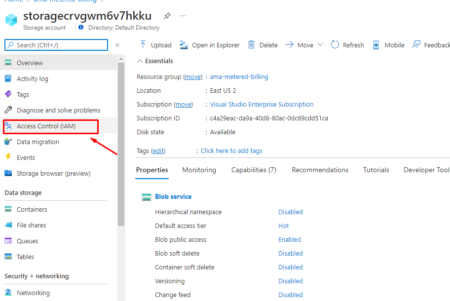

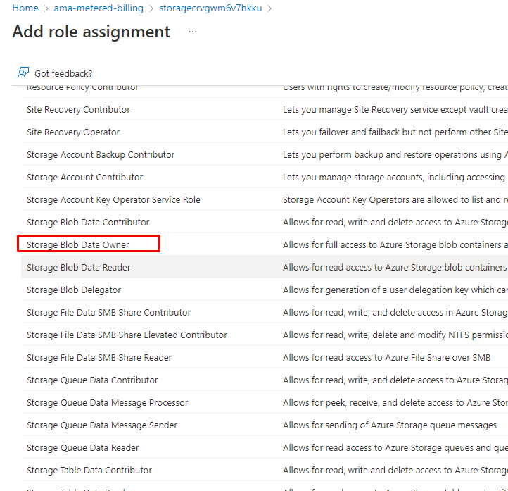


3. Grant Infrastructure AAD App a **Azure Event Hubs Data Owner Role** over the billing accelerator Event Hubs. 


### Deploy Publisher Notification function
Before Deploying Publisher Notification Function the following configuration list is needed to be handy
1. captureContainer : URI for capture storage account get it from Billing accelerator deployment
1. checkpointsContainer : URI for checkpoint storage account get it from Billing accelerator deployment
1. snapshotsContainer": URI for snapshot storage account get it from Billing accelerator deployment
1. eventhubInstance: eventhub name get it from Billing accelerator deployment
1. eventhubNamespace:eventhub namespace  get it from Billing accelerator deployment
From step **Create AAD Applications** capture the following
1. clientId
1. clientSecret
1. tenantId
1. marketplaceClientID 
1. marketplaceClientSecret
1. marketplaceTenantId

Use ARM template under `arm\PublisherDeployment` folder to deploy the function.

User could use Azure Portal to deploy the arm template using [Custom Deployment](https://portal.azure.com/#create/Microsoft.Template)

After deployment, catpure the *signature Guid* and *function URL*

### Update Managed App Main Template
After deploying Notification function update `mainTemplate.json` with the following
1. notificationWebHook_URI: https://<function url>/api/billing?sig=<dig>"
1. PID: Get it from Partner Center 

1. Update `mainTemplate.json` Line#189
### Package the Managed App
zip the content of folder `arm` and name give it relevant name. 


### Configure Partner Center

Under Techical Configuration
Add AAD Application ID that will configured to use for Marketplace billing API to emitting metered events
1. <b>tenantId</b> => "Azure Active Directory tenant ID"
1. <b>identityApplicationId</b>=> "Azure Active Directory application ID"


1. Create *New Plan* and give it name **privatemeter**
1. Under **Price and Availability**
- Add USA Market
- Add **0** as price per month
- Add **cpu1** with zero **Price per unit in USD**
- Add **mem1** with zero **Price per unit in USD**
- Save Draft
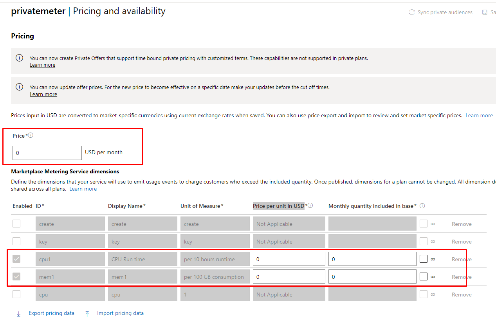
1. Under **Technical configuration** add ama package from perivous step to **Package file (.zip)**
1. Under **Technical configuration** add Notification URL as following https://<functionName>.azurewebsites.net/api?sig=<signature>
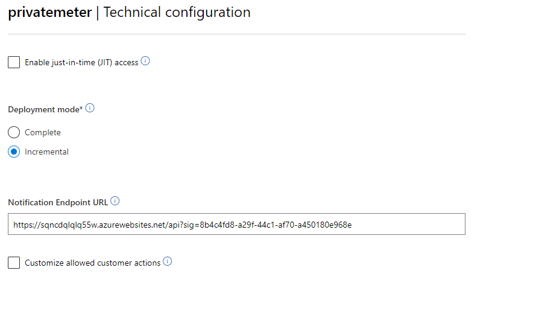
1. Click **Save Draft**
1. Click **Review & Publish**
1. Will wait till the offer reach preview stage
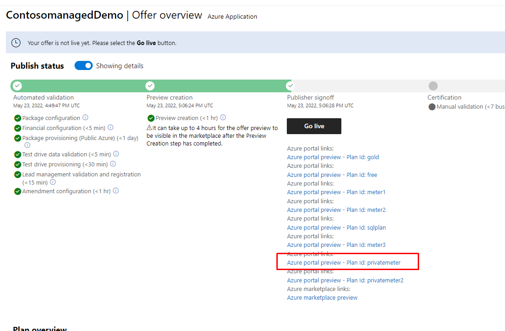


## Deploy As Customer
1. From Azure Portal go to create resource then select **see more in Marketplace**

1. Click View private product

1. Subscribe to **privatemeter** plan
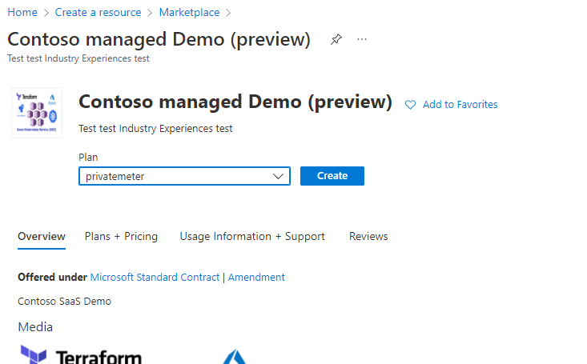
1. Fill the information 

1. Fill Storage infromation

1. Click Review & Create

## Test As Publisher
Using Application Insight Instance to confirm the creation
1. Open Application Insight Instance and go to logs
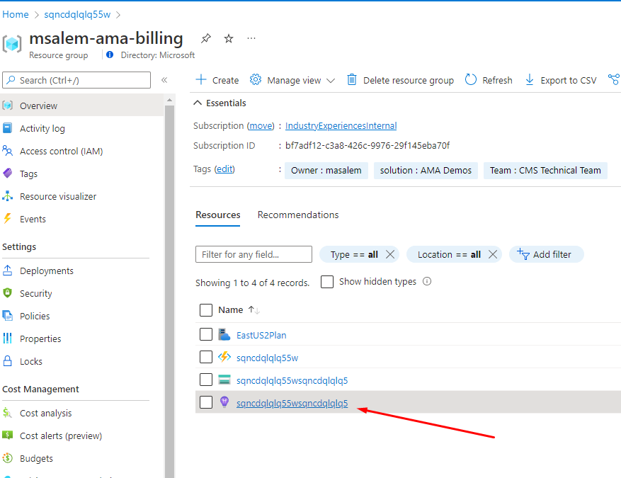

1. Run the following query to confirm the creation of ama resources
```
traces 
| where message contains "Successfully Subscribed managed app"
| where operation_Name contains "NotificationWebhook"
```
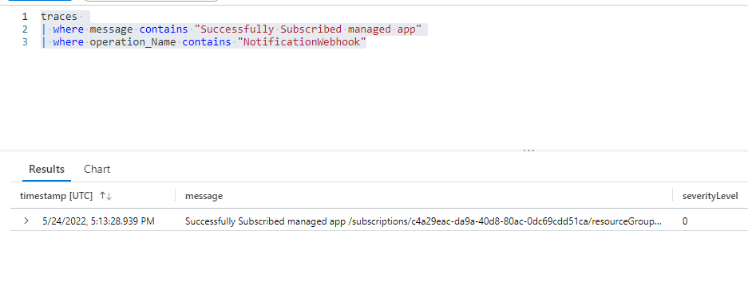
This confirm the acknowledgement of creating the ama resources
1.Run the following query to confirm receving metered events
```
traces 
| where message contains "Successfully Subscribed managed app"
| where operation_Name contains "MeteredWebhook"
```
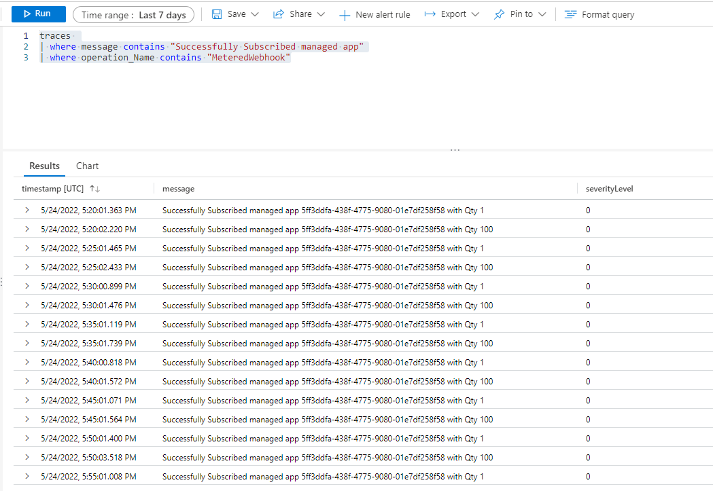

## Check Billing Accelerator progress
As publisher you can check quickly the billing accelerator status by downloading `latest.json.gz` file
1. Go to Metered billing resources
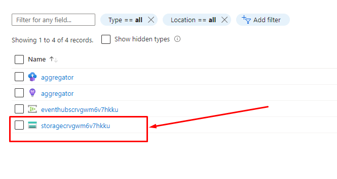
1. Open Storage and click on **Storage Browser** then click on **snapshots**
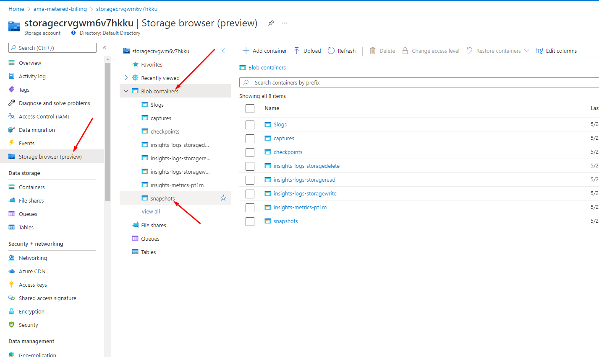
1. Download `latest.json.gz`

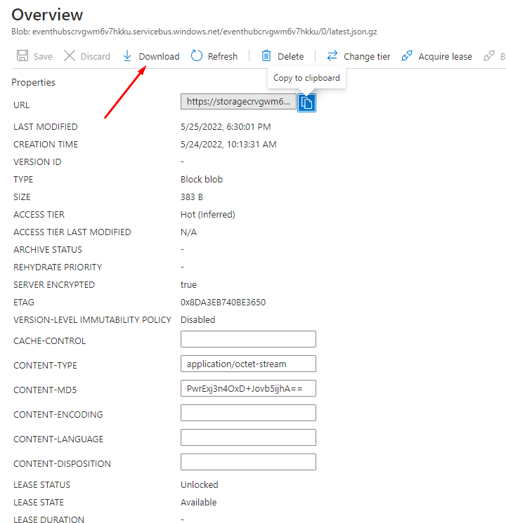
1. Unzip the file and format it using any JSON Format tool
Here is example for the formated JSON
```
{
   "lastProcessedMessage":{
      "partitionId":"0",
      "sequenceNumber":"840",
      "partitionTimestamp":"2022-05-26T01:35:01.224Z"
   },
   "meters":{
      "5ff3ddfa-438f-4775-9080-01e7df258f58":{
         "subscription":{
            "plan":{
               "planId":"privatemeter",
               "billingDimensions":{
                  "cpu1":0,
                  "mem1":0
               }
            },
            "renewalInterval":"Monthly",
            "subscriptionStart":"2022-05-24T17:13:26.5152305Z",
            "scope":"5ff3ddfa-438f-4775-9080-01e7df258f58"
         },
         "metersMapping":{
            "cpu1":"cpu1",
            "mem1":"mem1"
         },
         "currentMeters":{
            "cpu1":{
               "consumed":{
                  "consumedQuantity":8.0,
                  "created":"2022-05-26T01:00:01.119Z",
                  "lastUpdate":"2022-05-26T01:35:00.833Z"
               }
            },
            "mem1":{
               "consumed":{
                  "consumedQuantity":800.0,
                  "created":"2022-05-26T01:00:01.666Z",
                  "lastUpdate":"2022-05-26T01:35:01.224Z"
               }
            }
         },
         "usageToBeReported":[
            
         ],
         "lastProcessedMessage":{
            "partitionId":"0",
            "sequenceNumber":"840",
            "partitionTimestamp":"2022-05-26T01:35:01.224Z"
         }
      }
   },
   "unprocessable":[
      
   ]
}
```
Under **currentMeters** section you can check **consumed** section to monitor metered emitting quantity
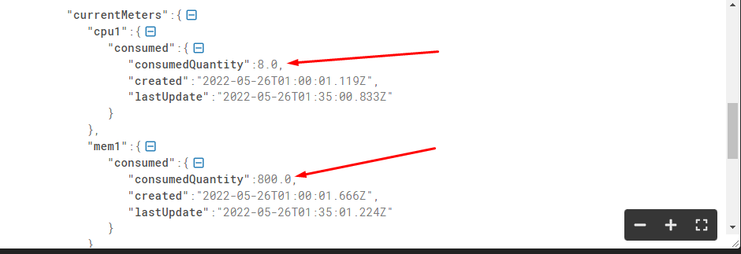
